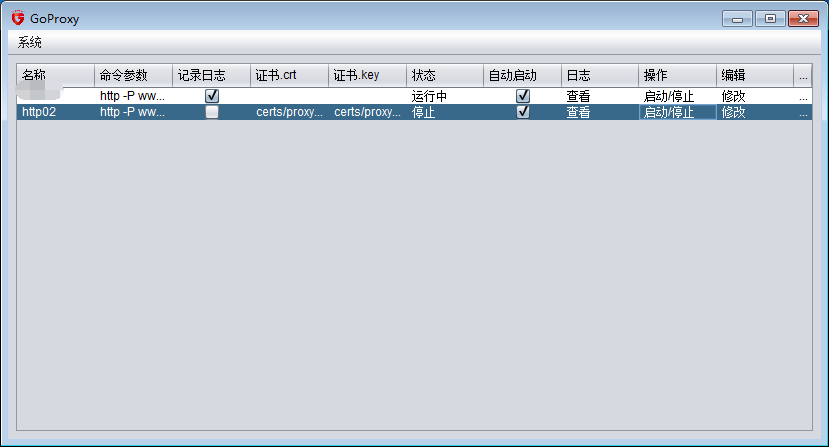
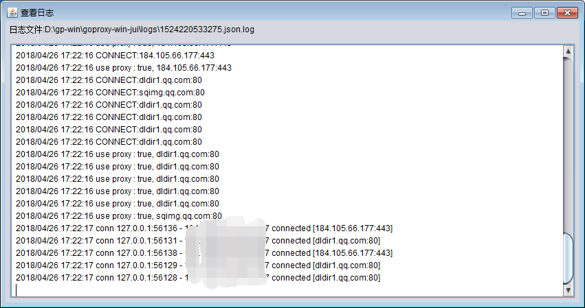
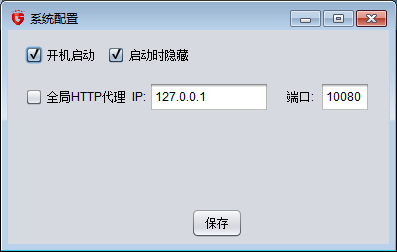

# goproxy-jui
Desktop version of https://github.com/snail007/goproxy,windows and linux are supported.Writting in java.
# Main UI
  

# Add Service
  

# View Log
  

# System Configuration
  

# System Tray
  

